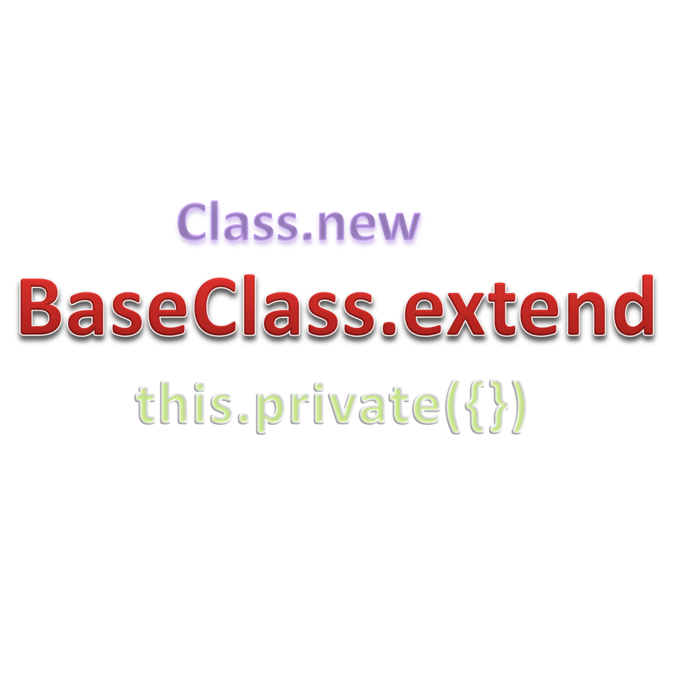

[base-class-extend](https://www.npmjs.org/package/base-class-extend) - npm
====

[BaseClass.extend](https://www.npmjs.org/package/base-class-extend) defines class in JavaScript.<br/>
This is simple module providing a simple Class function to
simplify class definition in JavaScript.

Supports getter/setter.

Easy to use, easy to inherit/extend.<br/>
Also supports inheritance from `Array`, `Error`, or Node.js `events.EventEmitter`.

no difficult keywords,<br/>
no `constructor`, no `prototype`, no `__proto__`,<br/>
no `Object.defineProperty`, no `Object.setPrototypeOf`, etc ...

[Japanese version/■日本語版はこちら■](README-JP.md#readme)



# INSTALL:

```bash
$ npm install base-class-extend
```

or

http://lightspeedworks.github.io/base-class/lib/base-class.js

```html
<script src="http://lightspeedworks.github.io/base-class/lib/base-class.js"></script>
```

# USAGE:

```js
var BaseClass = require('base-class-extend');
```

## method: Class.extend(name, proto, classProps)

  Define new class (constructor function) that inherited from Base Class.

### Format

```js
var YourClass = BaseClass.extend([name], [proto], [classProps]);
var YourSubClass = YourClass.extend([name], [proto], [classProps]);
```

### Parameters

  + **BaseClass**: Base class or Super class for inherits
  + **name**: string name of your class, optional
  + **proto**: the prototype object for your class, optional
    + **new**, **ctor** or **constructor**: constructor function, optional
    + **get** prop(): getter function, optional
    + **set** prop(value): setter function, optional
    + **any methods**: any method or member function, optional
  + **classProps**: the object for class or static properties, optional
    + **init**: initialize function, optional
    + **get** prop(): getter function, optional
    + **set** prop(value): setter function, optional
    + **any methods**: any static method or class function, optional

  You have to omit **classProps** also, if you omit **proto**.<br/>
  You have to specify **proto** or `{}`, if you want to specify **classProps**.

### Returns

  The newly defined class (constructor function). (Your class is subclass of BaseClass)

### Details

  A simple and quick sample:

```js
var BaseClass = require('base-class-extend');

var MyClass = BaseClass.extend({
  new: function MyClass(value) {
    this.value = value; // via setter
  },
  show: function show() {
    console.log(this.value); // via getter
  },
  // getter
  get value() { return this._value; },
  // setter
  set value(value) {
    if (value < 1 || value > 6)
      throw new RangeError('Out of range');
    this._value = value; },
});

var myObj = new MyClass(5);
myObj.value++; // 5 -> 6
myObj.show();
myObj.value++; // 6 -> 7 throws Error
```

## method: Class.new(...) or Class.create(...)

  Create an object, instance of the Class.

### Format

```js
var YourClass = BaseClass.extend('YourClass');
var yourObj = YourClass.new();

// or
var yourObj = YourClass.create();

// or
var yourObj = new YourClass();

// or
var yourObj = YourClass();
// required: default constructor or right defined constructor
```

### Parameters

  + **arguments**...: pass to constructor function, optional

### Returns

  Your new object, instance of the Class.

## without BaseClass, inherits from Object, or other Classes

### inherits from Object class

```js
Object.extend = BaseClass.extend;
var SimpleClass = Object.extend('SimpleClass');

// or simply
var SimpleClass = BaseClass.extend.call(Object, 'SimpleClass');
```

### inherits from Array class

```js
Array.extend = BaseClass.extend;
var CustomArray = Array.extend('CustomArray');

// or simply
var CustomArray = BaseClass.extend.call(Array, 'CustomArray');

var ca = new CustomArray(1, 2, 3);
// returns [1, 2, 3] like custom array.
```

### inherits from Error class

```js
Error.extend = BaseClass.extend;
var CustomError = Error.extend('CustomError');

// or simply
var CustomError = BaseClass.extend.call(Error, 'CustomError');

var ce = new CustomError('message');
```

### inherits from EventEmitter class

```js
var EventEmitter = require('events').EventEmitter;
EventEmitter.extend = BaseClass.extend;
var CustomEventEmitter = EventEmitter.extend('CustomEventEmitter');

// or simply
var CustomEventEmitter = BaseClass.extend.call(EventEmitter, 'CustomEventEmitter');
```

### inherits from all other class or constructor ... Function

```js
Function.prototype.extend = BaseClass.extend;

var SimpleClass = Object.extend('SimpleClass');
var CustomArray = Array.extend('CustomArray');
var CustomError = Error.extend('CustomError');

var EventEmitter = require('events').EventEmitter;
var CustomEventEmitter = EventEmitter.extend('CustomEventEmitter');
```

## method: this.private(proto)

  You can define private variables, hidden variables.<br/>
  Also support getter/setter, and normal methods to access private variables.

### Format

```js
// defined in 'new' method or 'constructor' function
var private1;
this.private({
  method1: function method1() {
    console.log(private1); },
  get prop1() { return private1; },
  set prop1(val) { private1 = val; },
});
```

### Parameters

  + **proto**: the prototype object contains methods accessing private variables, required
    + **get** prop(): getter function, optional
    + **set** prop(value): setter function, optional
    + **any methods**: any method or member function, optional

### Returns

  The prototype object you passed.

### Details

  Sample:

```js
var YourClass = BaseClass.extend({
  new: function YourClass() {
    var private1 = 123; // access via getter/setter
    var private2 = 'abc'; // access via getter, no setter
    this.private({
      get private1() { return private1; }, // getter
      set private1(val) { private1 = val; }, // setter
      get private2() { return private2; }, // getter
    });
  },
});
```

## property: this.constructor

  Get constructor function. (Class)

### Format

```js
var MyClass = BaseClass.extend('MyClass');
var o1 = new MyClass();
console.log(o1.constructor === MyClass); // -> true
```

### Returns

  The constructor function. (Class)

## property: this.constructors

  Get an array of constructor functions. (Classes)

### Format

```js
var MyClass = BaseClass.extend('MyClass');
var o1 = new MyClass();
var classes = o1.constructors;
console.log(classes[0] === MyClass);   // -> true
console.log(classes[1] === BaseClass); // -> true
console.log(classes[2] === Object);    // -> true
```

## Returns

  An array of constructor functions. (Classes)

## property: Class.constructors

  Get an array of constructor functions.

### Format

```js
var MyClass = BaseClass.extend('MyClass');
var classes = MyClass.constructors;
console.log(classes[0] === MyClass);   // -> true
console.log(classes[1] === BaseClass); // -> true
console.log(classes[2] === Object);    // -> true
```

## Returns

  An array of constructor functions.

# EXAMPLES:

```js
// Animal

// BaseClass
var BaseClass = require('base-class-extend');

// SimpleClass
var SimpleClass = BaseClass.extend('SimpleClass');
var s1 = new SimpleClass();

// Animal
var Animal = BaseClass.extend({
  new: function Animal(name) {
    if (!(this instanceof Animal))
      return Animal.new.apply(Animal, arguments);
    BaseClass.apply(this); // or Animal.super_.apply(this);
    this.name = name;
  },
  get name() { return this._name; }, // getter
  set name(name) { this._name = name; }, // setter
  introduce: function () {
    console.log('My name is ' + this.name);
  },
}, {
  init: function () {
    console.log('Animal class init');
  },
  animalClassMethod: function () {
    console.log('Animal class method');
  }
}); // -> Animal class init
var a1 = new Animal('Annie');
a1.introduce(); // -> My name is Annie
Animal.animalClassMethod(); // -> Animal class method

// Bear
var Bear = Animal.extend('Bear');
var b1 = Bear('Pooh'); // new less
b1.introduce(); // -> My name is Pooh

var Cat = Animal.extend({
  new: function Cat() {
    if (!(this instanceof Cat))
      return Cat.new.apply(Cat, arguments);
    Cat.super_.apply(this, arguments);
  }
});
var c1 = Cat.new('Kitty');
c1.introduce(); // -> My name is Kitty

var Dog = Animal.extend({
  new: function Dog() {
    if (!(this instanceof Dog))
      return Dog.new.apply(Dog, arguments);
    Dog.super_.apply(this, arguments);
  },
}, {
  init: function () {
    console.log('Dog class init');
  },
  dogClassMethod: function () {
    this.animalClassMethod();
    console.log('Dog class method');
  }
}); // -> Dog init
var d1 = Dog.new('Hachi'); // Class method new call
d1.introduce(); // -> My name is Hachi
Dog.dogClassMethod(); // -> Animal class method, Dog class method
Dog.animalClassMethod(); // -> Animal class method
```

```js
// Vector2D/Vector3D

// BaseClass
var BaseClass = require('base-class-extend');

// sample: JavaScript Object.defineProperty - SONICMOOV LAB
// http://lab.sonicmoov.com/development/javascript-object-defineproperty/

var Vector2D = BaseClass.extend({
  new: function Vector2D(x, y) {
    this._length = 0;
    this._changed = true;
    this._x = x;
    this._y = y;
  },
  get x()  { return this._x; },
  set x(x) { this._x = x; this._changed = true; },
  get y()  { return this._y; },
  set y(y) { this._y = y; this._changed = true; },
  get length() {
    if (this._changed) {
      this._length = Math.sqrt(this._x * this._x + this._y * this._y);
      this._changed = false;
    }
    return this._length;
  },
  set: function (x, y) { this._x = x; this._y = y; this._changed = true; },
});

var v2 = new Vector2D(3, 4);
console.log('V2D(3, 4):', v2.length);
v2.set(1, 2);
console.log('V2D(1, 2):', v2.length);
v2.set(1, 1);
console.log('V2D(1, 1):', v2.length);

var Vector3D = Vector2D.extend({
  new: function Vector3D(x, y, z) {
    Vector2D.call(this, x, y);
    this._z = z;
  },
  get length() {
    if (this._changed) {
      this._length = Math.sqrt(this._x * this._x + this._y * this._y + this._z * this._z);
      this._changed = false;
    }
    return this._length;
  },
  set: function (x, y, z) { this._x = x; this._y = y; this._z = z; this._changed = true; },
});

var v3 = new Vector3D(3, 4, 5);
console.log('V3D(3, 4, 5):', v3.length);
```

# LICENSE:

  MIT
